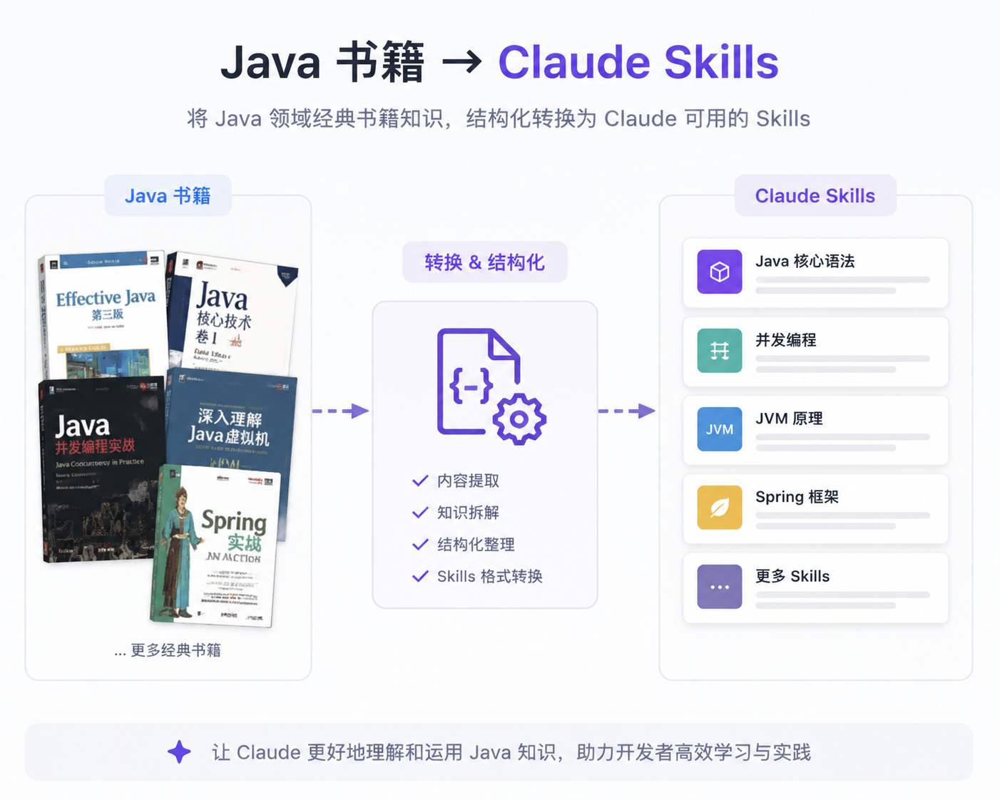

<p align="center">
  
</p>

<p align="center">
  <a href="README.md">English</a> ·
  <a href="README.zh-CN.md">简体中文</a> ·
  <a href="README.ja.md">日本語</a> ·
  <a href="README.ko.md">한국어</a> ·
  <a href="README.es.md">Español</a> ·
  <b>Français</b> ·
  <a href="README.de.md">Deutsch</a> ·
  <a href="README.pt-BR.md">Português</a> ·
  <a href="README.ru.md">Русский</a>
</p>

# Anthropic Java Skills

> Un catalogue d'**Agent Skills** distillés à partir de livres Java, prêts à être utilisés avec Claude / Claude Code. Chaque skill est livré à la fois en **chinois (zh)** et en **anglais (en)**.

## Structure du dépôt

```
Anthropic-Java-Skills/
├── README.md                                # this file (English); other languages: README.<lang>.md
├── assets/                                  # images used by the READMEs
├── skills/                                  # all skills
│   └── alibaba-java-coding-guidelines/      # one book = one folder
│       ├── README.md                        # per-book readme
│       ├── zh/                              # Chinese skill
│       │   ├── SKILL.md
│       │   └── references/
│       └── en/                              # English skill
│           ├── SKILL.md
│           └── references/
└── docs/                                    # source PDFs and material (gitignored)
```

Conventions :

- **Un livre, un dossier**, nommé en kebab-case, placé sous `skills/`.
- Chaque livre possède des sous-dossiers fixes `zh/` et `en/`, **chacun étant un skill complet et autonome** (avec son propre `SKILL.md` et `references/`).
- Les versions `zh` et `en` d'un livre partagent le même `name` (le champ `name` dans le frontmatter), donc **n'installez qu'une seule langue par répertoire de skills** pour un livre donné afin d'éviter les collisions de noms.
- Les PDF / livres électroniques sources vont sous `docs/` et sont exclus via `.gitignore` — **ne validez pas de contenu protégé par le droit d'auteur**.

## Catalogue de skills

| Livre | Dossier | Langues | Description |
|------|--------|-----------|-------------|
| Manuel de développement Java d'Alibaba (édition Huangshan) | [`skills/alibaba-java-coding-guidelines`](skills/alibaba-java-coding-guidelines) | zh · en | Les normes officielles de codage Java d'Alibaba : programmation, exceptions et journalisation, tests unitaires, sécurité, MySQL, structure de projet, conception. Pour écrire et relire du code Java conformément à la norme. |

> D'autres livres à venir.

## Installation et utilisation

Ces skills ne sont **pas** chargés automatiquement du simple fait de leur présence dans ce dépôt — il s'agit d'un **catalogue**. Pour en activer un dans
Claude Code, installez la **langue unique** souhaitée dans un répertoire de skills.

**Option 1 : Copie**

```bash
# user-level (available everywhere)
cp -r skills/alibaba-java-coding-guidelines/en ~/.claude/skills/alibaba-java-coding-guidelines

# or project-level (one project only)
cp -r skills/alibaba-java-coding-guidelines/zh /path/to/your/project/.claude/skills/alibaba-java-coding-guidelines
```

**Option 2 : Lien symbolique (reste synchronisé avec ce dépôt)**

```bash
ln -s "$(pwd)/skills/alibaba-java-coding-guidelines/en" ~/.claude/skills/alibaba-java-coding-guidelines
```

Une fois installé, Claude consulte automatiquement le skill lorsque vous écrivez ou relisez du code Java (selon sa
`description`), ou vous pouvez le déclencher explicitement. Pour changer de langue, supprimez la copie installée et
installez l'autre.

## Ajouter un nouveau livre

1. Créez `skills/your-book-name/` (kebab-case) sous `skills/`.
2. Ajoutez les sous-dossiers `zh/` et `en/`, chacun avec un `SKILL.md` + `references/`.
3. `SKILL.md` nécessite un frontmatter : `name` (identique pour les deux langues d'un livre) et `description` (indiquez clairement les scénarios de déclenchement ; être un peu « proactif » améliore le taux de déclenchement).
4. Découpez le corps par thème dans `references/`, donnez à `SKILL.md` un index et un aide-mémoire à haute fréquence, et suivez la **divulgation progressive** (gardez `SKILL.md` léger, chargez les détails à la demande).
5. Mettez à jour le tableau « Catalogue de skills » de ce README et rédigez un README par livre `skills/your-book-name/README.md`.
6. Placez le livre électronique source sous `docs/` et assurez-vous qu'il est exclu par `.gitignore`.

Vous pouvez utiliser le skill officiel `skill-creator` pour rédiger, valider et évaluer de nouveaux skills.

## Licence et attribution

Le contenu des skills présents ici est **adapté des livres respectifs** ; le droit d'auteur appartient aux
auteurs/éditeurs originaux et il est fourni à des fins d'apprentissage et de référence technique. Ne validez pas de
livres électroniques sources protégés par le droit d'auteur (le `.gitignore` exclut déjà `*.pdf`).
